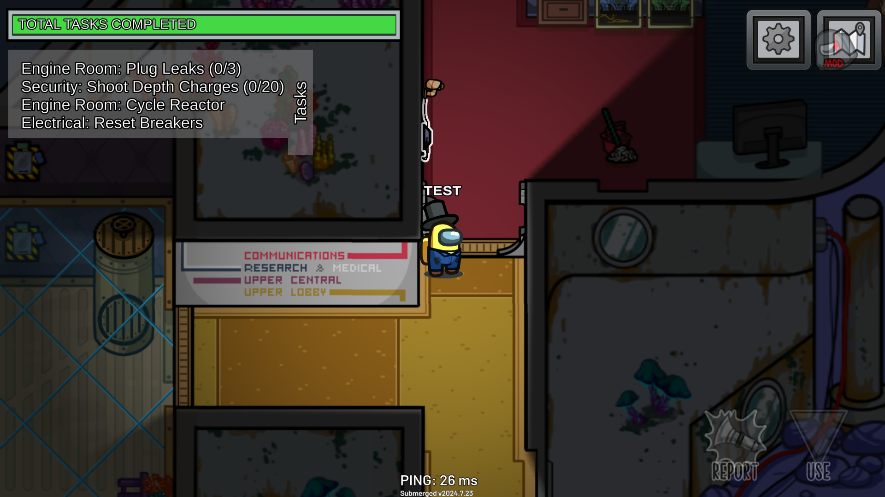
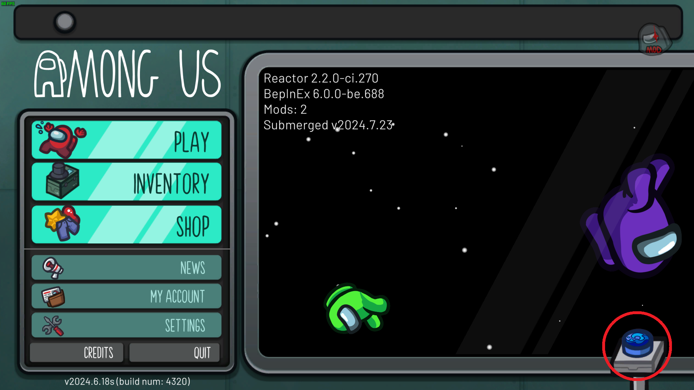
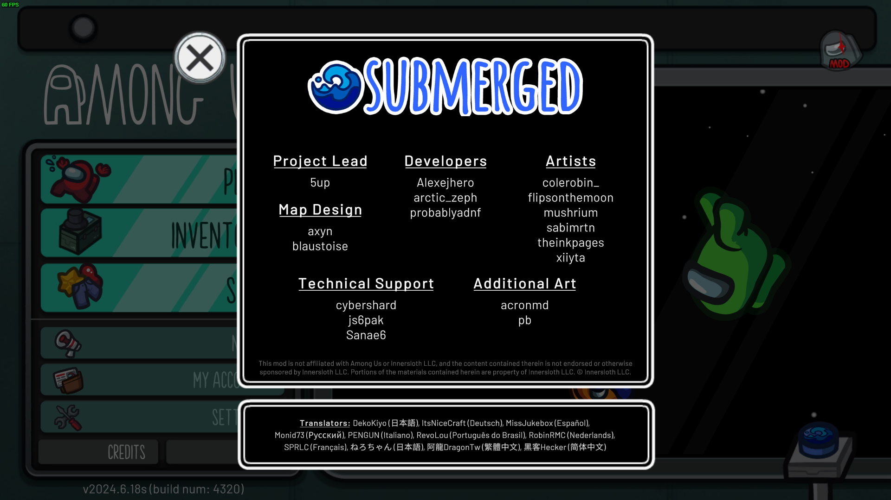
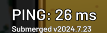

### NOTE: THIS IS A DRAFT AND IS WORK IN PROGRESS

---

# Stop PingTracker Abuse
This is an initiative to standardize how Among Us mods should and should not alter the PingTracker.

`Draft 4.1, 10th of August 2024`

## Supporters
Developers of well-known that support this initiative include:
- [Alexejhero](https://github.com/Alexejhero), Submerged developer and creator of this initiative
- [MyDragonBreath](https://github.com/MyDragonBreath), Town of Us Reactivated developer _(mod changes pending)_
- [probablyadnf](https://github.com/simonkellly), Submerged developer

# Guidelines

## What is the PingTracker for?
You should only add content to the PingTracker for diagnostic or information purposes. For example, displaying the current mod name and version, displaying role information or displaying current game mode is acceptable.

**The PingTracker should not be used as a watermark or for displaying credits, especially during active gameplay.**

Here is an example of a good PingTracker patch, from our [Submerged](https://github.com/SubmergedAmongUs/Submerged) mod:

Click to view details

  
 
The PingTracker uses a smaller font to fit and is also displayed only when Submerged is the current map. It's only purpose is so that we can easily identify what version someone is playing if they send me a clip of a bug.
  

  

## General PingTracker guidelines
The following guidelines apply to the PingTracker as a whole, and should be followed regardless of what kind of modifications you make.

Note: While this initiative only explicitly mentions the PingTracker, creating a separate text object to display your watermark is literally the same thing and it obviously included.

### Minimum requirements
- You must ensure that the original functionality of the PingTracker remains, and not remove the ping indicator, unless removing the ping indicator is an explicit feature of your mod.
- Individual people or companies such as authors, developers, collaborators, etc should not be named in the PingTracker.
- You should not use a larger font size than the default for your PingTracker text, nor should you increase the overall scale of the PingTracker.
- Moving the PingTracker from the default location (bottom center) is acceptable, but you must place it adjacent to the top or bottom edges of the screen, with no padding from the edge of the screen.

### Best practices
- The PingTracker should not be moved from it's default location (bottom center).
- You should not add any other information to the PingTracker except mod identifiers (details below).
- You should not use any kind of formatting (bold, italic, underline) for the purposes of drawing attention to the PingTracker.

## Mod identifier guidelines
Even though the PingTracker should not serve as a watermark, there should be a way to quickly identify what mods someone is playing from a video or a stream, in order to diagnose potential issues.

The suggested way of doing this is including your mod name and description in the PingTracker. I will refer to this style of PingTracker patch as a "mod identifier". The following guidelines apply only to mod identifiers.

If you are adding other information to the PingTracker, such as displaying the current game mode or role information, you do not need to follow these guidelines (for those specific instances of text). That being said, I advise not adding this kind of information to the PingTracker, and creating your own text objects instead, because you can never know what other mods might change about the PingTracker. 

### Minimum requirements
- The mod identifier should not use flashy or rainbow colors for the purposes of drawing attention to it. You should use at most two colors, with at most one change between them. (No alternating colors)
- The mod identifier should not be animated in any way.

### Best practices
- The mod identifier should have the default color of the PingTracker (white). An exception is made for special versions of your mod, which may use a single different color. (For example, red for debug builds) _(TODO: Should this be expanded and better defined?)_ 
- The mod identifier should use a smaller font size of `<size=50%>`.
- The mod identifier should be placed after the ping indicator.
- A mod identifier should be hidden if that mod is disabled or does not have any effect on current gameplay.
- If there are multiple mods installed, their mod identifiers should be displayed on the same line, in alphabetical order. _(TODO: Implement this as a Reactor feature)_

## What about credits?
I acknowledge that crediting people for their work is important, however naming them in the PingTracker is a relic of the past and should not be the first solution you think about. (More info in the [Reasoning](#reasoning) section)

Having your name written on the screen at all times doesn't help you in any way, and it is also just an intrusive obstacle to both regular players, and streamers and their viewers.

If you want to implement credits, you should find a different way of doing so. You can add a button to the main menu, have them displayed in the VersionShower instead, or you can come up with your own idea.

Here is an example of how we implemented credits in [Submerged](https://github.com/SubmergedAmongUs/Submerged):

Click to view details

  
 
We added a button in the main menu, which when clicked opens a pop-up displaying the credits.
  

  

## Exceptions
If you do not want to invest time in creating an alternative for displaying credits, which is understandable, it is acceptable to use the PingTracker to display your credits, but _**only in the pre-game lobby**_. In such a case, moving it to a more accessible location is acceptable. However, keep in mind that this is NOT preferred, since other mods might also interfere with the PingTracker. As such, the second easiest (and best) solution would be creating your own text object to display the credits on.

## Reasoning
Have you ever seen a main-stream, popular mod for any other game to do this?

The reason PingTracker watermarks exist in the first place is because people used to add them on mods they sold to content creators during the early days of Among Us modding. Since content creators only showed gameplay, that meant that modders would sometimes not be credited for their work unless they added their name in the PingTracker, and even so some YouTubers chose to put their face cam over them.

Now, while this is true even in the present to some extent, I think it is bad practice to modify the PingTracker for credits. If you want to use a YouTube video or Twitch stream as an example of your previous work, you do not need to have your name on there. Having the mod name is enough, and sometimes you don't even need that.

My name is written in both the credits menu of Submerged and in the repository, so I do not need to add it to the PingTracker. I can use Submerged as a past project on my resume or a reference when pitching to potential clients because I can prove that I worked on it. I don't need my name in the top right of every video and every stream to prove that.

I think that writing the mod name is obviously acceptable so people know what they're playing, but you don't need to make it bigger or increase the scale or make it flashy. It doesn't need to draw attention or take up more screen space, you don't want it to turn into a watermark.

## Final thoughts

If all you're after is credits, look around at other modding communities and you will see how they do it. 

There is no need to watermark your mod, so keep it simple, keep it minimal, and keep it small. People who care about it _will_ know who the developers are, and you will not be forgotten.

